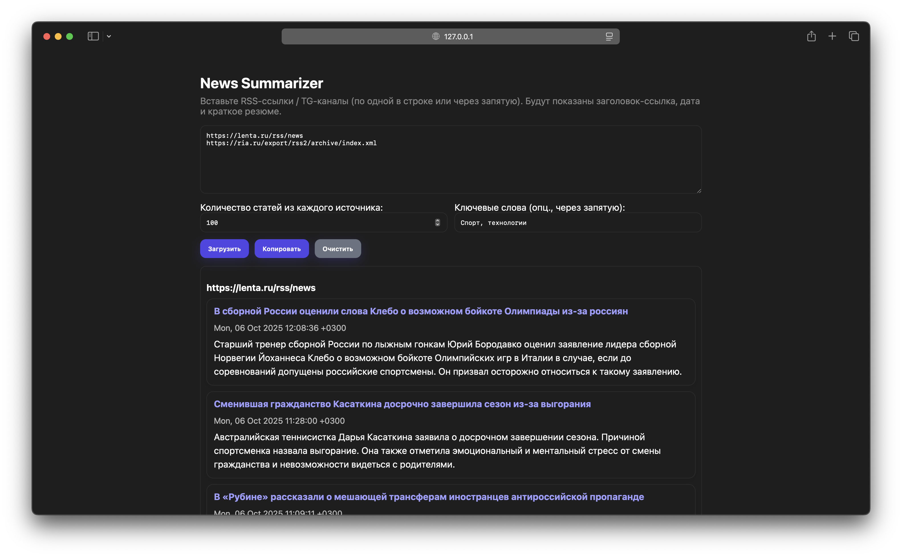

# News Aggregator project for [hh.ru hackathon](https://hackathon.hhtech.ru)
[Try Demo](icycactus.com)

---

## About
This project aims to **reduce time people spend** on scrolling through endless stream of news and articles.
<br>
Users are now able to choose **WebSites** and **Telegram** channels to get compressed versions of articles
**based on their interests.**



## Contents
- [Main](#news-aggregator-project-for-hhru-hackathon)
- [About](#about)
- [Contents](#contents)

## How to use
- ### Run Locally:
  - Clone this repo: `git clone https://github.com/buuuuulat/news_aggregator.git && cd news_aggregator`
  - Install requirements: `python3 install_requirements.py`
  - Create and configure `.env` file in project directory:
    ```.dotenv
    # Telegram Bot
    TELEGRAM_BOT_TOKEN=<ENTER_TG_BOT_TOKEN_HERE>
    ```
  - Run: `python3 backends/run_all.py`
> Note: First run may take some time to download weights of the model

Enter links to **RSS Sources / TG Channels** and **Keywords**, press Load / Загрузить and wait for response.

:)
